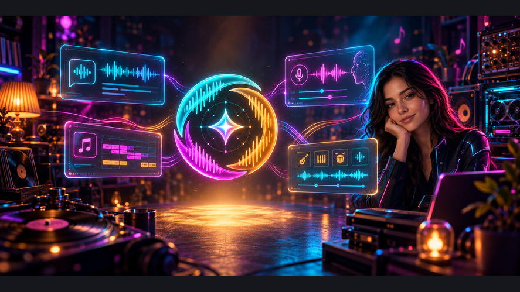

# Compozitorium AI Studio

Десктоп-приложение на Tauri 2 + React. Нужны [Bun](https://bun.sh) и [Rust](https://rustup.rs).



## Запуск

```shell
make run
```

Окно приложения (`tauri dev`). Только браузер:

```shell
make run-web
```

## Сборка

Готовые пакеты всех платформ копируются в `release/` в корне проекта по маске
`compozitorium_<версия без точек>_<платформа>.<расширение>` (версия берётся из `src-tauri/tauri.conf.json`).

### Linux

```shell
make build
```

Пакет: `release/compozitorium_010_x64.deb`

### Windows

С Linux (кросс через cargo-xwin):

```shell
sudo apt install llvm lld nsis clang
make build-windows
```

Инсталлятор: `release/compozitorium_010_x64.exe`

На самой Windows достаточно `make build-windows` (без xwin).

### Android

1. JetBrains Toolbox → Android Studio (JDK берётся из `~/.local/share/JetBrains/Toolbox/apps/android-studio/jbr`).
2. SDK: по умолчанию `~/Android/Sdk` (`ANDROID_HOME`).
3. Android Studio → SDK Manager → SDK Tools → **NDK (Side by side)**.
4. Для запуска — эмулятор AVD **Pixel_9**.

```shell
make build-android
make run-android
```

APK: `release/compozitorium_010_android.apk` (unsigned, все ABI)

`run-android` поднимает Pixel_9, если `adb` ещё не видит устройство.

### macOS

Пока не собирается.
